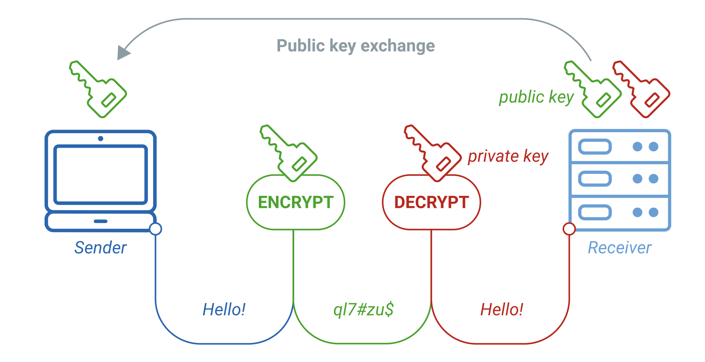
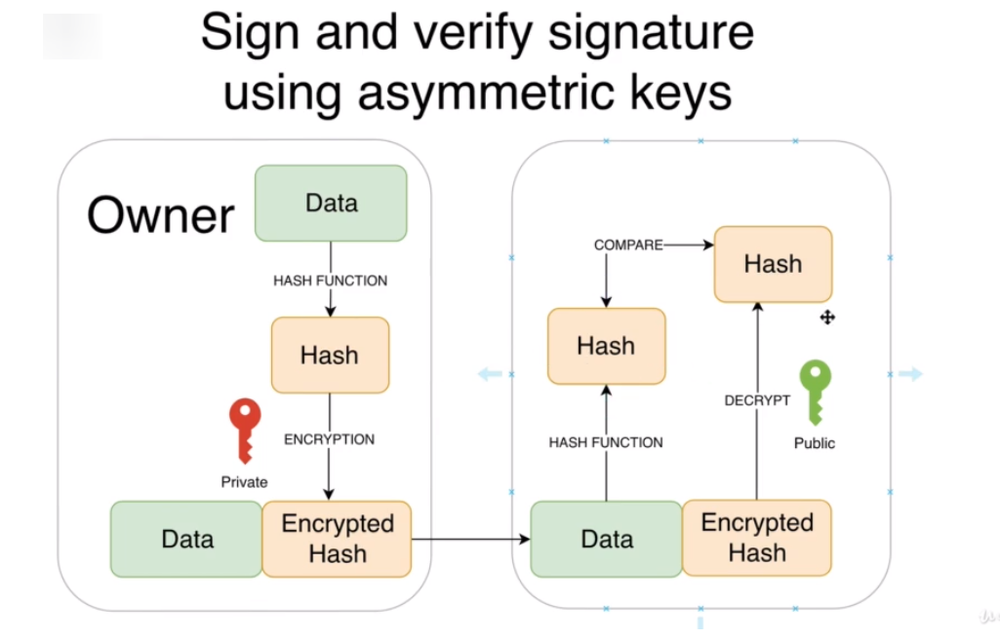
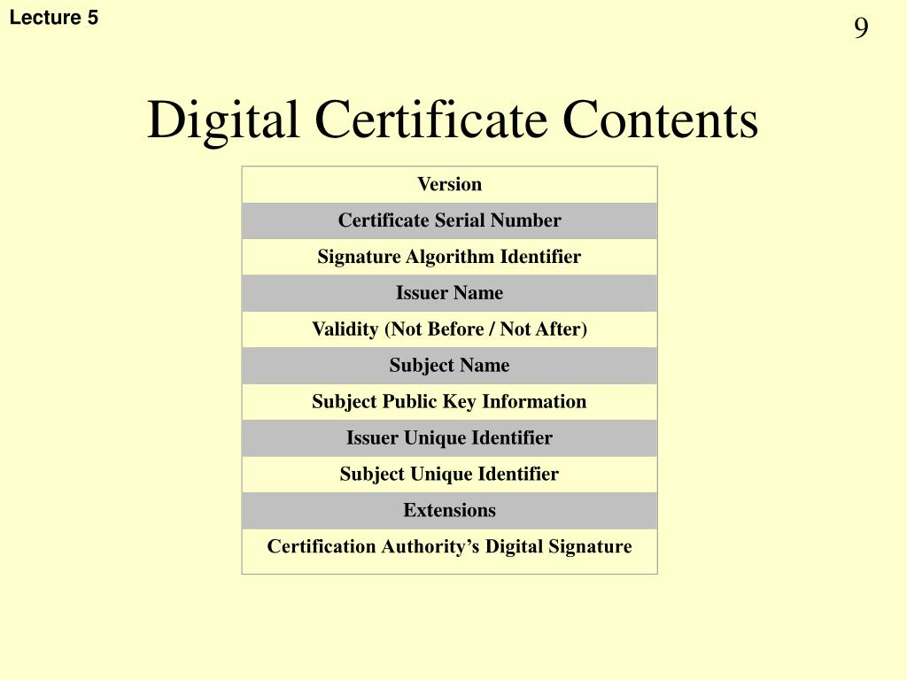
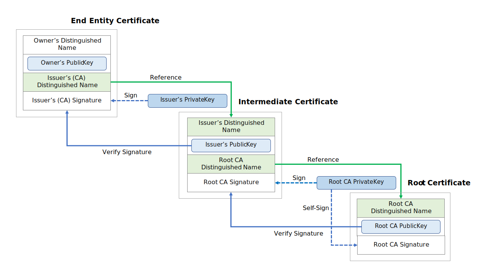
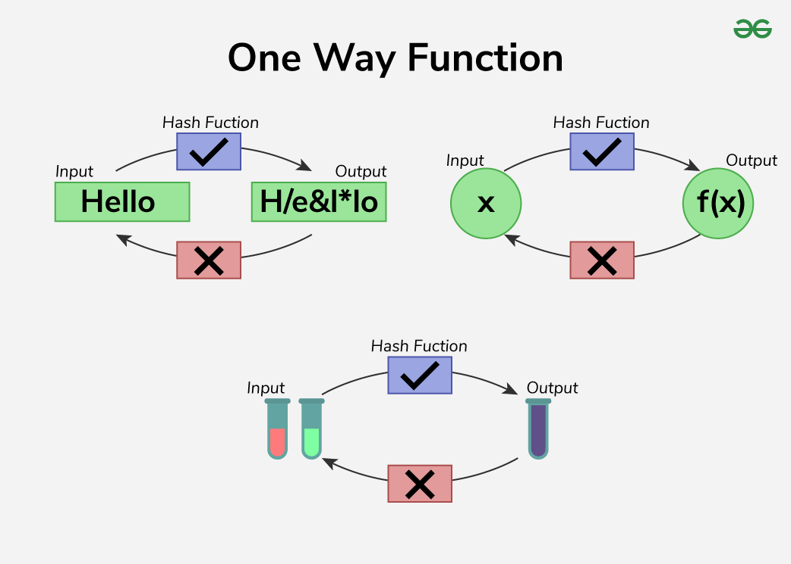
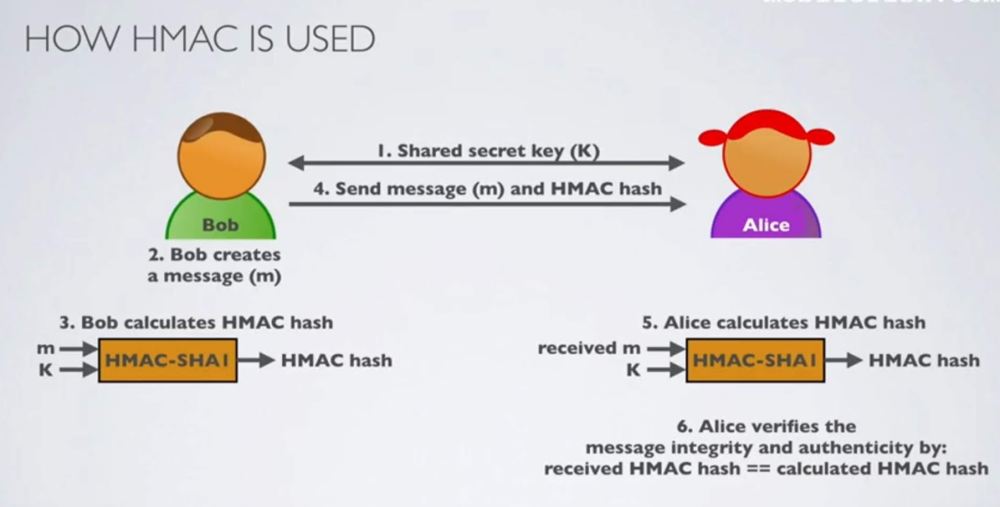
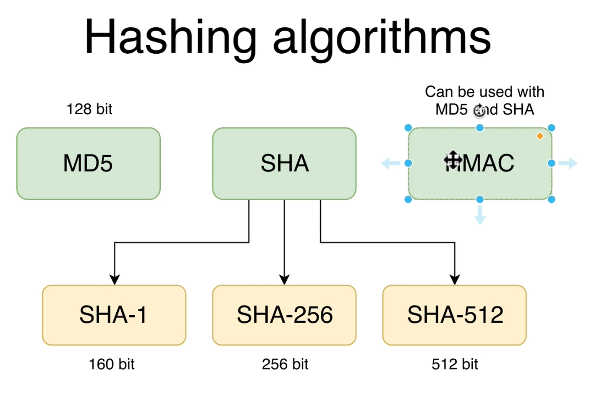

# TLS/SSL Notes
- Security General Notes
  - https://docs.google.com/document/d/1hytcZ2gSLuAwZzIu5spI5Xk8Yx4cwMKIXKM9-m0TfpY/edit?tab=t.0#heading=h.iny33cizzt7r
- SSL Tutorials
  - https://www.udemy.com/course/ssl-complete-guide/
- Notes for SSL certificate management
  - https://bit.ly/ssl_cert_mgmt
- DNS
  - https://bit.ly/dns_mini_series

## Encryption
- **Symmetric algorithms (Single shared key)**
  - AES (AES 128 bits,256 bits etc..)
  - It is more secure than DES and DES3 (56 bit keys) because it use keys of higher length.
  - Faster than Assymetric key encryption.
- **Assymetric Algorithms (Public/Private Keys)**
  

        
         
  

  
  - RSA (Algorithm)
    - **Key Length :** 1024, 2048,3072,4096 bits
  - Public key is used for data encryption and only entity with private key can decrypt the data.
  - Public key encryption are slower due to larger key lengths.
  - Private keys is used for authentication and digital signing.
    

        
         
    

## PKI (Public Key Infrastructure)
- https://www.geeksforgeeks.org/public-key-infrastructure/
- Public key of every entity in PKI should be trusted by other entities in PKI
  - Entities are like Root CA, Intermediate CA, website owners and their certificates

## Certificate
- Certificate is a file with below content
  - Website Owner details
  - Certificate issuer details (Entity who Signed the certificate)
  - Signature (Private key encrypted hash with the CA's private key)
  - Website owners public key.
  - Multi Domain Certificates
    - Certificates that have defined multiple domains as extensions are called Multi domain certificates.
    - It can be used on multiple domains.
- **Digital Certificate Content**
    

        
         
    

  
- **Digital Signature Process**
    

        
         
    

  
    - The Website response data is digitally signed using the private key of the website owner.
      - The response content is hashed with SHA-256 and encrypted with owners private key to digitally sign.
      - The signed data along with the Certificate is the digitally signed data.

- **Root CA**
  - Subject and Issuer are exactly same for self signed root certificate signed by ROOT CA.
  - Self signed certs are signed by the private keys of the subject (ROOT CA here ) itself.
  - How are Root CA certs trusted by web browsers ?
    - All Root CA certs are loaded into OS by default and so they are by default trusted by the browser.
  - WHere can we see the certs?
    - **MAC**
      - Search key chain access on mac (command + space bar)
      - Open key chain access and select System Roots , you will see all certs.
    - **Windows**:
      - ctrl + r and then type in certmgr.msc , it will show all certs preinstalled.
- **Chain Of Trust**
   

        
         
   

 
    - How end user certificate is securely signed by private key of the issuer CA ?
      - Signing occurs on the intermediate issuer CA server with its private key in the same server , A CSR from the user
          is sent to the intermediate CA , where the CA signs the CSR with its own private key adds the issuer details.
      - The CSR consists of below:
        - The public key
        - The organization's identity information
        - A digital signature created using the private key to prove ownership of the key
        - The CSR file is typically in PEM format.

## Hashing
   

        
         
   

- Hash functions are one way , a hashed data cannot be retrieved back to the original data.
- When a data is hashed it is converted to a fixed length string as per the hashing algorithm (128,256 bits etc..).
- **Advantage in Digital signature**
  - when a data is digitally signed , it is basically used to identify the authenticity of the entity who is sending the data.
  - Because the data is signed using private key, so whoever has the public key can decrypt and verify the authenticity 
     and if any tampering happened.
  - So whoever decrypts the data can also see the data , but if we hash and then sign , the end user will only be able to see the hash not data.
    - This secures the data in a way.
  - **Hashing are of 2 types**
    - **Simple hashing with no Keys (SHA-256,MD5 etc)**
      - MD5- 128 bit
        - MD5 hash has 32 characters and hash length is 128 bits , so each character is 4 bits long (128/32 = 4)
      - SHA-1: 160 ,SHA-256: 256 bits,SHA-512: 512 bits
    - **Key based hashing (HMAC-SHA-256,HMAC-MD5)**
    

          
           
     

    
      - They use symmetric keys to add an extra layer of authentication along with just data integrity.
      - It says that the data shared between entities that share the same key and so they trust each other somehow , 
          however key needs to be shared securely.It authenticates the sender of data.

- **Hashing Algorithms**
    

          
           
     

- **Certificate Fingerprints** are just hash of the certificate itself nothing else.

## Commands
- To fetch the IP address of a website or domain
  - `nslookup <website address>`
    - Eg: `nslookup www.instagram.com`
  - `dig <website address>`
    - Gives more details about the DNS records

## FAQ
1. **Why hash the datum and then apply encryption for digital signing ?**
   1. **Performance Optimization**
      - Efficiency: Hash functions (like SHA-256) are extremely fast compared to encryption algorithms.
      - Instead of encrypting the entire content, which may be large (like a document or a video file), 
                  only a small fixed-size hash (digest) is encrypted.
   2. **Consistent Output Size**
      - Fixed Size: A hash digest has a fixed size regardless of the content length (e.g., SHA-256 always produces a 256-bit hash).
      - Encrypting a hash instead of variable-length data simplifies the signature process and reduces the encryption workload.
   3. **Integrity Check (Detect Tampering)**
      - Tamper Detection: If even a single bit of the content changes, the hash will produce a completely different value.
      - When the recipient decrypts the hash and compares it to a newly computed hash of the content, they can detect 
         whether the content was tampered with.
   4. **Compatibility with Asymmetric Algorithms**
      - Key Size Limitation: Asymmetric encryption algorithms (like RSA) have limits on the size of data they can encrypt.
         Encrypting a hash instead of the entire content ensures compatibility with these size restrictions.
   5. **Digital Signature Standards (Best Practice)**
      Standards Compliance: 
      - Digital signature schemes (like RSA-SHA256) specify hashing as part of the signing process for secure, efficient,
         and standard-compliant operations.
   - Hashing is oneway , we cannot get back the data which is hashed using some algorithm like SHA-256 etc...
